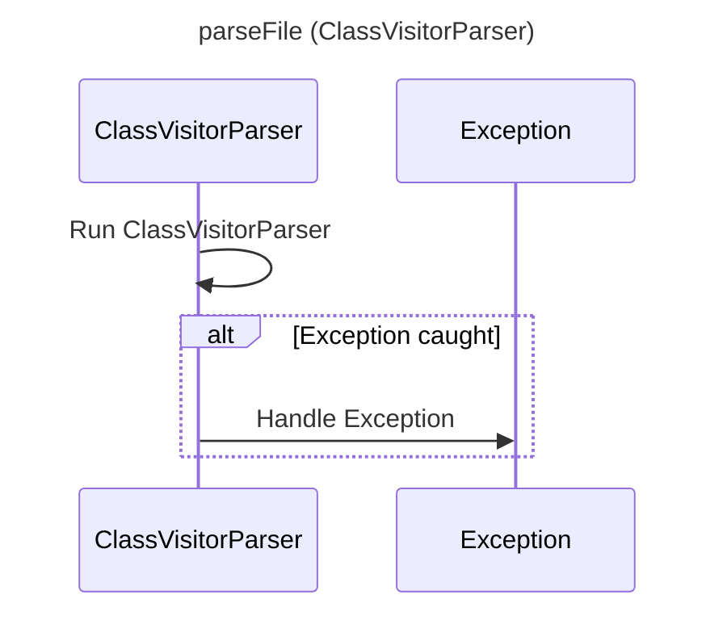

----
# FIX RAW RESPONSE 2
# Participants

- ClassVisitorParser
- Exception

# Validation Fixes

- Fix the class name formatting: Remove the angle brackets in the exception class name.

# Interaction After Fix

- ClassVisitorParser runs the `parseFile` method.
- If an exception is thrown, it is caught and handled.

# Final Participants

- ClassVisitorParser

# Plain English Title

parseFile (ClassVisitorParser)

# Mermaid Sequence Diagram

