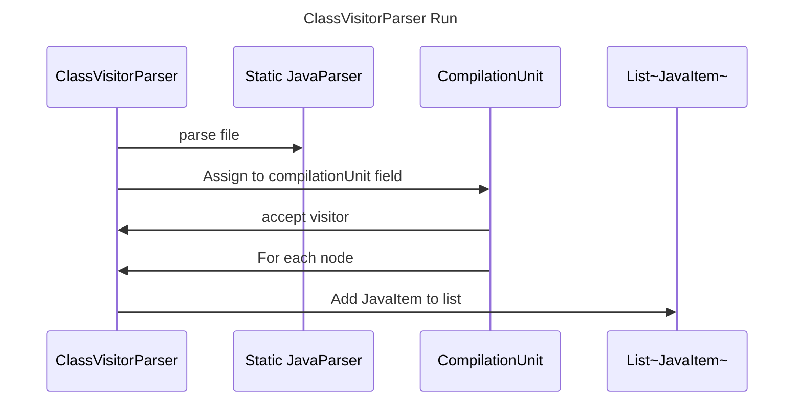

----
# ORIGINAL RESPONSE 
# Participants

- ClassVisitorParser
- Pattern
- List<JavaItem>
- File
- StaticJavaParser
- CompilationUnit

# Initial Interactions

1. ClassVisitorParser is called to parse a Java file.
2. The `run` method in ClassVisitorParser is invoked with a File argument.
3. StaticJavaParser is used to parse the Java file into a CompilationUnit.
4. The CompilationUnit is assigned to the `compilationUnit` field of ClassVisitorParser.
5. The `accept` method is called on the CompilationUnit, passing in ClassVisitorParser and null as arguments.
6. The CompilationUnit accepts the visitor ClassVisitorParser.
7. The `visit` method is called on ClassVisitorParser for each node in the CompilationUnit.
8. The visitor methods in ClassVisitorParser process the nodes and perform specific actions.
9. The `run` method returns the list of Java items.

# Clean Interactions

1. ClassVisitorParser->>StaticJavaParser: parse file
2. ClassVisitorParser->>CompilationUnit: Assign to compilationUnit field
3. CompilationUnit->>ClassVisitorParser: accept visitor
4. CompilationUnit->>ForEachNode: call visitor.visit
5. ForEachNode-->>ClassVisitorParser: visit each node
6. ClassVisitorParser->>List<JavaItem>: Add JavaItem to list

# Final Participants

- ClassVisitorParser
  - static
    - StaticJavaParser
  - CompilationUnit
  - List~JavaItem~

# Plain English Title

ClassVisitorParser Run

# Mermaid Sequence Diagram

