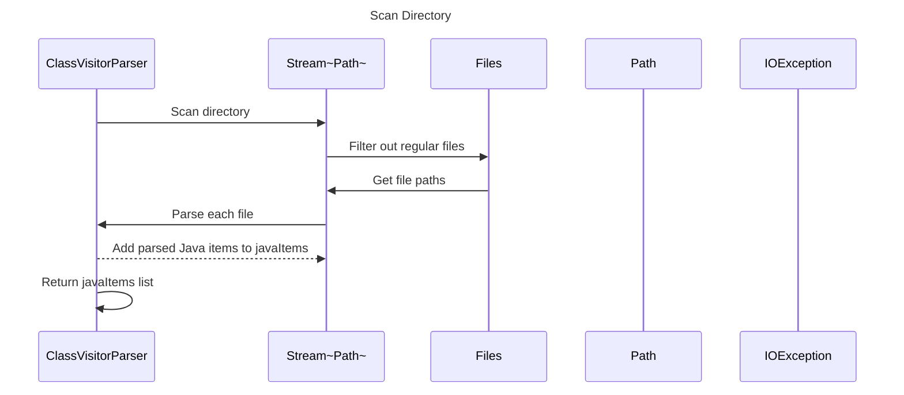

----
# ORIGINAL RESPONSE 
# Participants

* ClassVisitorParser
* VoidVisitorAdapter
* Pattern
* List<JavaItem>
* CompilationUnit
* Stream<Path>
* Files
* Path
* File
* IOException

# Initial Interactions

1. ClassVisitorParser scans a directory.
2. ClassVisitorParser walks through the directory path.
3. ClassVisitorParser filters out the regular files.
4. ClassVisitorParser filters for files with the extension ".java".
5. ClassVisitorParser parses each file using the parseFile method.
6. ClassVisitorParser adds the parsed Java items to the javaItems list.
7. ClassVisitorParser returns the javaItems list.

# Clean Interactions

1. ClassVisitorParser -> Stream<Path>: Scan directory.
2. Stream<Path> -> Files: Filter out regular files.
3. Files -> Stream<Path>: Get file paths.
4. Stream<Path> -> ClassVisitorParser: Parse each file.
5. ClassVisitorParser -->> Stream<Path>: Add parsed Java items to javaItems.
6. ClassVisitorParser ->> ClassVisitorParser: Return javaItems list.

# Final Participants

* ClassVisitorParser
   - Interaction 5
   - Interaction 6
* Stream<Path>
   - Interaction 2
   - Interaction 4
* Files
   - Interaction 3
* Path
   - Interaction 2
* IOException
   - Interaction 4

# Plain English Title

Scan Directory

# Mermaid Sequence Diagram

