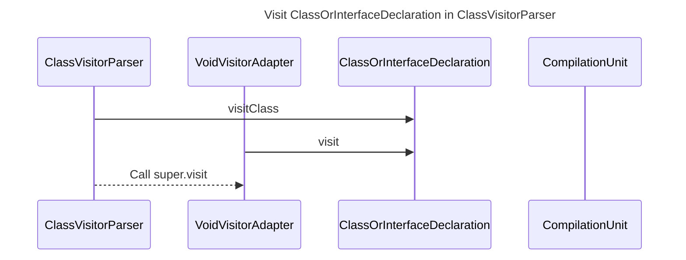

----
# ORIGINAL RESPONSE 
# Participants
1. ClassVisitorParser
2. VoidVisitorAdapter
3. ClassOrInterfaceDeclaration
4. NodeWithName
5. CompilationUnit

# Initial Interactions
- ClassVisitorParser visits ClassOrInterfaceDeclaration
- If the class is not an inner class and not static, visitClass is called on the ClassVisitorParser

# Clean Interactions
- ClassVisitorParser->>ClassOrInterfaceDeclaration: visitClass
- VoidVisitorAdapter->>ClassOrInterfaceDeclaration: visit
- ClassVisitorParser-->>VoidVisitorAdapter: Call super.visit

# Final Participants
- ClassVisitorParser
  - ClassVisitorParser->>ClassOrInterfaceDeclaration: visitClass
- VoidVisitorAdapter
  - VoidVisitorAdapter->>ClassOrInterfaceDeclaration: visit
  - ClassVisitorParser-->>VoidVisitorAdapter: Call super.visit
- ClassOrInterfaceDeclaration
- CompilationUnit

# Plain English Title
Visit ClassOrInterfaceDeclaration in ClassVisitorParser

# Mermaid Sequence Diagram

