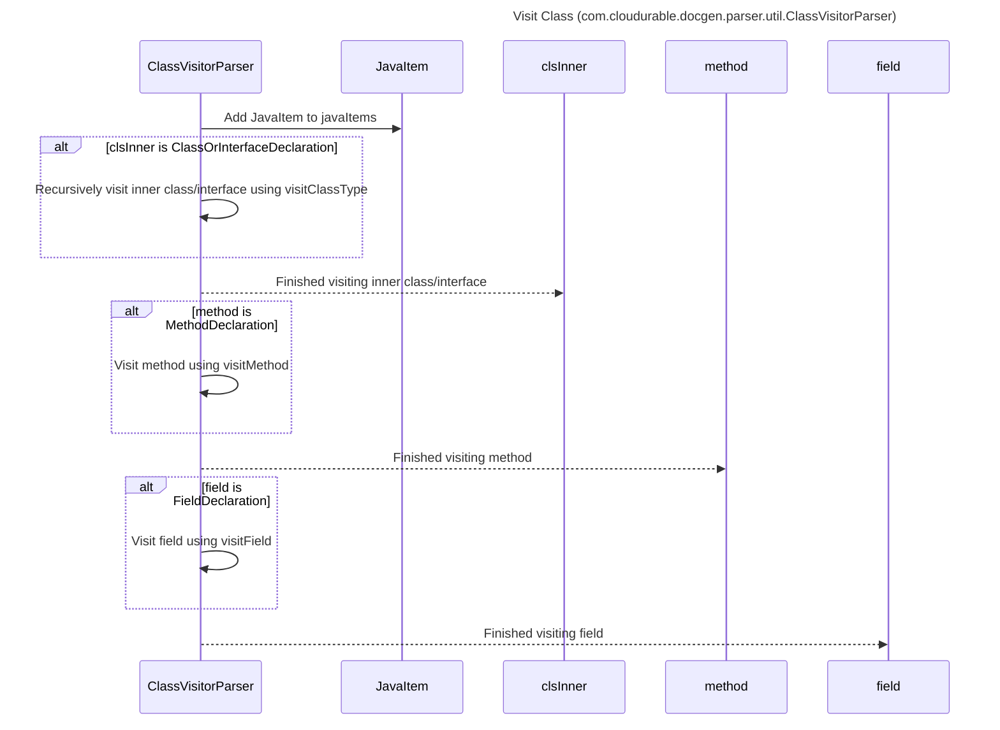

----
# ORIGINAL RESPONSE 
# Participants

* ClassVisitorParser 
* VoidVisitorAdapter
* JavaItem
* Pattern 
* CompilationUnit 
* ClassOrInterfaceDeclaration 
* String 
* packageName 
* importBody 
* cls 
* parts 
* javaDoc 
* code 
* javaItem 
* JavaItemType 
* name 
* simpleName 
* definition 
* body 
* clsInner 
* method 
* field 

# Initial Interactions

1. ClassVisitorParser creates an instance of `JavaItem` with `importBody`, `type`, `name`, `simpleName`, `definition`, `javadoc`, `body` from the method parameters.
2. ClassVisitorParser adds the created `JavaItem` to the `javaItems` list.
3. ClassVisitorParser iterates over the child nodes of `cls` and visits the inner classes/interfaces using visitClassType method.
4. ClassVisitorParser iterates over the methods of `cls` and visits each method using visitMethod method.
5. ClassVisitorParser iterates over the fields of `cls` and visits each field using visitField method.

# Clean Interactions

1. ClassVisitorParser -->> JavaItem: Add JavaItem to javaItems
2. alt clsInner is ClassOrInterfaceDeclaration
	1. ClassVisitorParser ->> ClassVisitorParser: Recursively visit inner class/interface using visitClassType
3. ClassVisitorParser -->> clsInner: Finished visiting inner class/interface
4. alt method is MethodDeclaration
	1. ClassVisitorParser ->> ClassVisitorParser: Visit method using visitMethod
5. ClassVisitorParser -->> method: Finished visiting method
6. alt field is FieldDeclaration
	1. ClassVisitorParser ->> ClassVisitorParser: Visit field using visitField
7. ClassVisitorParser -->> field: Finished visiting field

# Final Participants

* ClassVisitorParser
    * ClassVisitorParser -->> JavaItem
    * ClassVisitorParser ->> ClassVisitorParser (alt)
* JavaItem
    * clsInner
    * method
    * field
* ClassOrInterfaceDeclaration
    * ClassVisitorParser -->> clsInner
* MethodDeclaration
    * ClassVisitorParser -->> method
* FieldDeclaration
    * ClassVisitorParser -->> field
* String

# Plain English Title
Visit Class (com.cloudurable.docgen.parser.util.ClassVisitorParser)

# Mermaid Sequence Diagram

