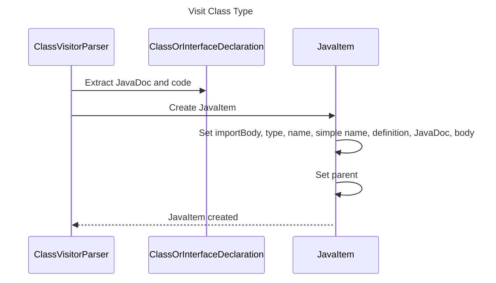

----
# FIX RAW RESPONSE 1
# Participants

1. ClassVisitorParser
2. ClassOrInterfaceDeclaration
3. JavaItem

# Validation Fixes
The validation error is due to the presence of a number in the diagram. To fix this, remove the number from the diagram.

# Interaction After Fix

1. ClassVisitorParser->>ClassOrInterfaceDeclaration: Extract JavaDoc and code
2. ClassVisitorParser->>JavaItem: Create JavaItem
3. JavaItem->>JavaItem: Set importBody, type, name, simple name, definition, JavaDoc, body
4. JavaItem->>+JavaItem: Set parent
5. JavaItem-->>ClassVisitorParser: JavaItem created

# Final Participants

1. ClassVisitorParser
2. ClassOrInterfaceDeclaration
3. JavaItem

# Plain English Title

Visit Class Type

# Mermaid Sequence Diagram

