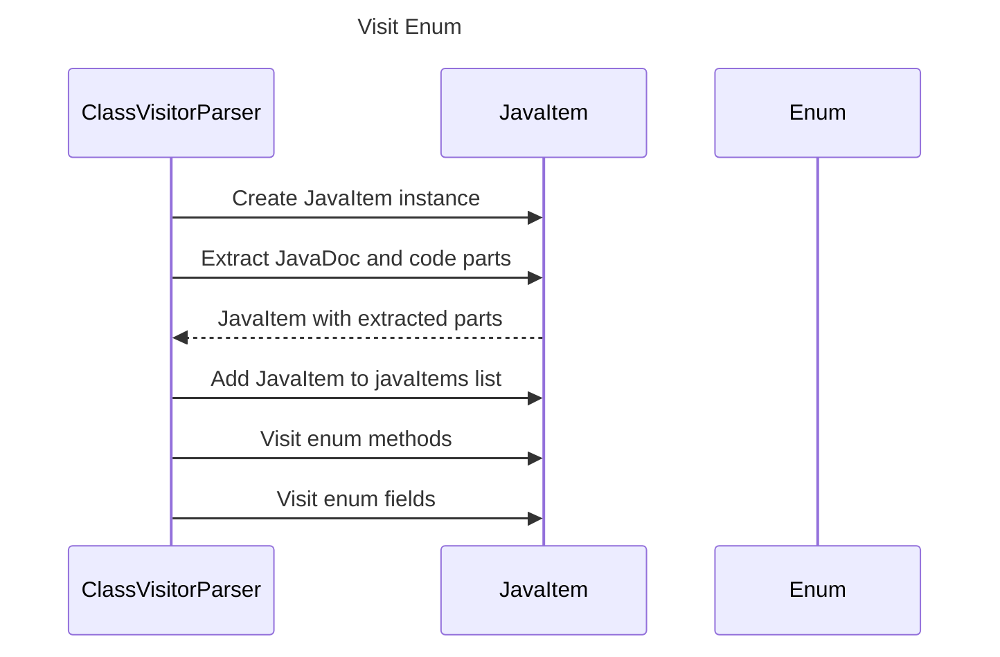

----
# ORIGINAL RESPONSE 
# Participants

1. ClassVisitorParser
2. JavaItem
3. EnumDeclaration
4. CompilationUnit
5. Enum
6. String

# Initial Interactions

1. ClassVisitorParser creates an instance of JavaItem
2. ClassVisitorParser extracts JavaDoc and code parts from the enum declaration
3. JavaItem is built with the extracted parts and added to the javaItems list
4. ClassVisitorParser visits each method in the enum declaration
5. ClassVisitorParser visits each field in the enum declaration

# Clean Interactions

1. ClassVisitorParser->>JavaItem: Create JavaItem instance
2. ClassVisitorParser->>JavaItem: Extract JavaDoc and code parts
3. JavaItem-->>ClassVisitorParser: JavaItem with extracted parts
4. ClassVisitorParser->>JavaItem: Add JavaItem to javaItems list
5. ClassVisitorParser->>ClassVisitorParser: Visit enum methods
6. ClassVisitorParser->>ClassVisitorParser: Visit enum fields

# Final Participants

- ClassVisitorParser
- JavaItem
- Enum
- String

- ClassVisitorParser
  - ClassVisitorParser->>JavaItem
  - ClassVisitorParser->>JavaItem
  - ClassVisitorParser->>ClassVisitorParser
  - ClassVisitorParser->>ClassVisitorParser

- JavaItem
  - JavaItem-->>ClassVisitorParser

- Enum
  - ClassVisitorParser->>JavaItem
  - ClassVisitorParser->>JavaItem

- String
  - JavaItem-->>ClassVisitorParser

- REMOVE

# Plain English Title

"Visit Enum"

# Mermaid Sequence Diagram

