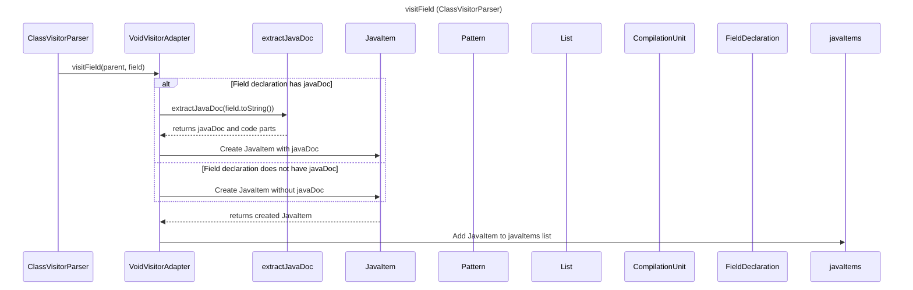

----
# ORIGINAL RESPONSE 
# Participants

1. ClassVisitorParser
2. VoidVisitorAdapter
3. JavaItem
4. Pattern
5. List
6. CompilationUnit
7. FieldDeclaration

# Initial Interactions

- ClassVisitorParser creates a new `VoidVisitorAdapter`.
- ClassVisitorParser invokes `visitField` method passing `parent` and `field` parameters.
- VoidVisitorAdapter calls `extractJavaDoc` method passing `field.toString()` as a parameter.
- VoidVisitorAdapter assigns the extracted javaDoc and code to `parts[0]` and `parts[1]` respectively.
- VoidVisitorAdapter creates a new `JavaItem` passing appropriate parameters.
- VoidVisitorAdapter adds the created `JavaItem` to the `javaItems` list.

# Clean Interactions

```mermaid

ClassVisitorParser->>VoidVisitorAdapter: visitField(parent, field)
VoidVisitorAdapter->>extractJavaDoc: extractJavaDoc(field.toString())
extractJavaDoc-->>VoidVisitorAdapter: returns javaDoc and code parts
loop For each field declaration
    alt Field declaration has javaDoc
        VoidVisitorAdapter->>JavaItem: Create JavaItem with javaDoc
    else Field declaration does not have javaDoc
        VoidVisitorAdapter->>JavaItem: Create JavaItem without javaDoc
    end
    JavaItem-->>VoidVisitorAdapter: returns created JavaItem
    VoidVisitorAdapter->>javaItems: Add JavaItem to javaItems list
end

```

# Final Participants

- ClassVisitorParser
  - visitField
- VoidVisitorAdapter
  - extractJavaDoc
  - JavaItem
- JavaItem
- Pattern
- List
- CompilationUnit
- FieldDeclaration

# Plain English Title

visitField (ClassVisitorParser)

# Mermaid Sequence Diagram


