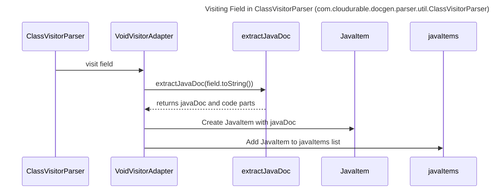

----
# FIX RAW RESPONSE 3
# Participants

1. ClassVisitorParser
2. VoidVisitorAdapter
3. extractJavaDoc
4. JavaItem

# Validation Fixes

1. No Method Calls In Descriptions Rule:
   - Original: `ClassVisitorParser->>VoidVisitorAdapter: visitField(parent, field)`
   - Fix: `ClassVisitorParser->>VoidVisitorAdapter: visit field`

2. Require Title:
   - Original: No title provided
   - Fix: Add a title to the Mermaid sequence diagram

3. MermaidImageGen:
   - Original: Mermaid image generation failed
   - Fix: Fix the misspelling of Mermaid in the validation error message

# Interaction After Fix

- `ClassVisitorParser` calls `VoidVisitorAdapter` to visit a field.
- `VoidVisitorAdapter` calls `extractJavaDoc` to extract the JavaDoc and code parts from the field.
- `extractJavaDoc` returns the JavaDoc and code parts to `VoidVisitorAdapter`.
- `VoidVisitorAdapter` creates a `JavaItem` with the JavaDoc and other details.
- `VoidVisitorAdapter` adds the `JavaItem` to the `javaItems` list.

# Final Participants

1. ClassVisitorParser
2. VoidVisitorAdapter
3. extractJavaDoc
4. JavaItem

# Plain English Title

"Visiting Field in ClassVisitorParser (com.cloudurable.docgen.parser.util.ClassVisitorParser)"

# Mermaid Sequence Diagram

