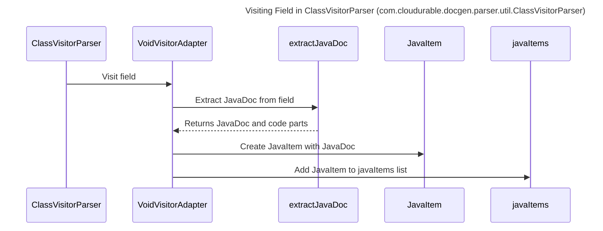

----
# FIX RAW RESPONSE 2
# Participants

- ClassVisitorParser
- VoidVisitorAdapter
- extractJavaDoc
- JavaItem

# Validation Fixes

The validation issue is: `No Method Calls In Descriptions Rule`.

To fix this issue, we replace the method call in the interaction description with plain English.

Before fix:
`VoidVisitorAdapter->>extractJavaDoc: extractJavaDoc(field.toString())`

After fix:
`VoidVisitorAdapter->>extractJavaDoc: Extract JavaDoc from field`

# Interaction After Fix

- ClassVisitorParser calls `visitField` on VoidVisitorAdapter.
- VoidVisitorAdapter calls `extractJavaDoc` to extract JavaDoc from the field.
- extractJavaDoc returns the JavaDoc and code parts to VoidVisitorAdapter.
- VoidVisitorAdapter creates a JavaItem with the extracted JavaDoc.
- VoidVisitorAdapter adds the JavaItem to the javaItems list.

# Final Participants

- ClassVisitorParser
- VoidVisitorAdapter
- extractJavaDoc

# Plain English Title

"Visiting Field in ClassVisitorParser (com.cloudurable.docgen.parser.util.ClassVisitorParser)"

# Mermaid Sequence Diagram

