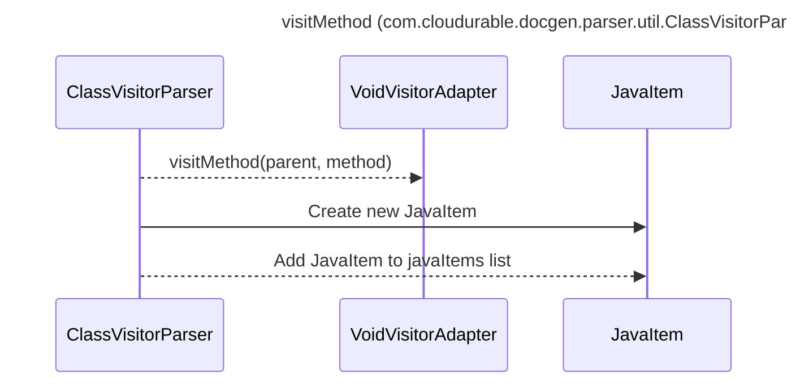

----
# ORIGINAL RESPONSE 
# Participants

* ClassVisitorParser
* VoidVisitorAdapter
* JavaItem
* CompilationUnit
* Modifier
* Type
* Parameter
* NodeList
* AnnotationExpr

# Initial Interactions

* ClassVisitorParser calls `visitMethod`
* `visitMethod` takes `JavaItem parent` and `MethodDeclaration method` as parameters
* `visitMethod` gets the method modifiers, type, parameters, annotations, javaDoc, and code
* `visitMethod` creates a new `JavaItem` and adds it to the `javaItems` list

# Clean Interactions

* ClassVisitorParser -->> VoidVisitorAdapter: visitMethod(parent, method)
* ClassVisitorParser->>JavaItem: Create new JavaItem
* ClassVisitorParser-->>JavaItem: Add JavaItem to javaItems list

# Final Participants

* ClassVisitorParser
  * visitMethod
* VoidVisitorAdapter
* JavaItem
  * Create new JavaItem
  * Add JavaItem to javaItems list

# Plain English Title

visitMethod (com.cloudurable.docgen.parser.util.ClassVisitorParser)

# Mermaid Sequence Diagram

