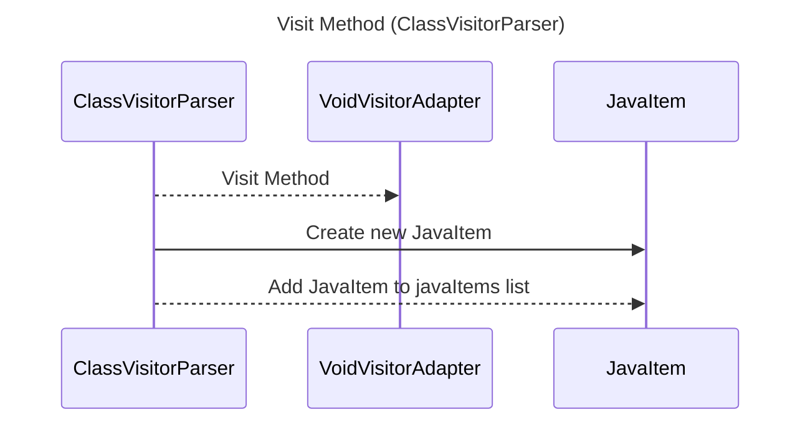

----
# FIX RAW RESPONSE 3
# Participants

- ClassVisitorParser
- VoidVisitorAdapter
- JavaItem

# Validation Fixes

There is one validation issue in the broken Mermaid sequence diagram. The issue is related to using method calls in the interaction description. The fix is to replace the method call with a plain English description. 

The validation issue:
- No Method Calls In Descriptions Rule: No method calls in descriptions. Instead of `ClassVisitorParser -->> VoidVisitorAdapter: visitMethod(parent, method)`, use `ClassVisitorParser -->> VoidVisitorAdapter: Visit Method`.

# Interaction After Fix

- ClassVisitorParser -->> VoidVisitorAdapter: Visit Method
- ClassVisitorParser->>JavaItem: Create new JavaItem
- ClassVisitorParser-->>JavaItem: Add JavaItem to javaItems list

# Final Participants

- ClassVisitorParser
- VoidVisitorAdapter
- JavaItem

# Plain English Title

"Visit Method (ClassVisitorParser)"

# Mermaid Sequence Diagram

