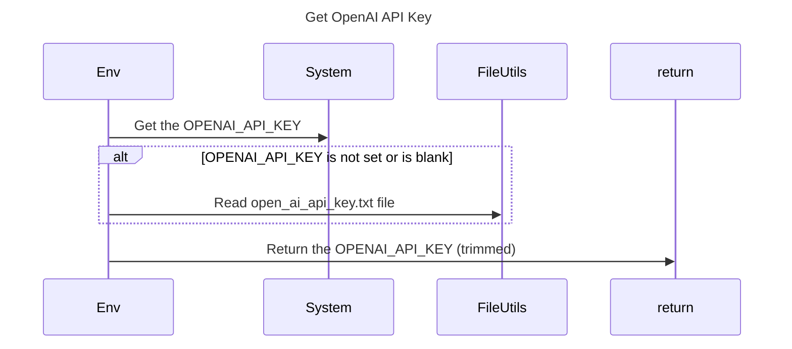

----
# ORIGINAL RESPONSE 
## Participants

- Env
- System
- FileUtils
- File

## Initial Interactions

1. The `Env` class calls the `System` class to get the `OPENAI_API_KEY` environment variable.
2. If the `OPENAI_API_KEY` environment variable is not set or is blank, the `Env` class calls the `FileUtils` class to read the `open_ai_api_key.txt` file from the `./config/` directory.

## Clean Interactions

1. `Env` ->> `System`: Get the `OPENAI_API_KEY`
2. `alt` `OPENAI_API_KEY` is not set or is blank
    - `Env` ->> `FileUtils`: Read `open_ai_api_key.txt` file
3. `Env` ->> `return`: Return the `OPENAI_API_KEY` (trimmed)

## Final Participants

- Env
  - Interactions: `Env` ->> `System`, `Env` ->> `FileUtils`, `Env` ->> `return`
- System
  - Interactions: `Env` ->> `System`
- FileUtils
  - Interactions: `Env` ->> `FileUtils`

## Plain English Title

Get OpenAI API Key

## Mermaid Sequence Diagram

