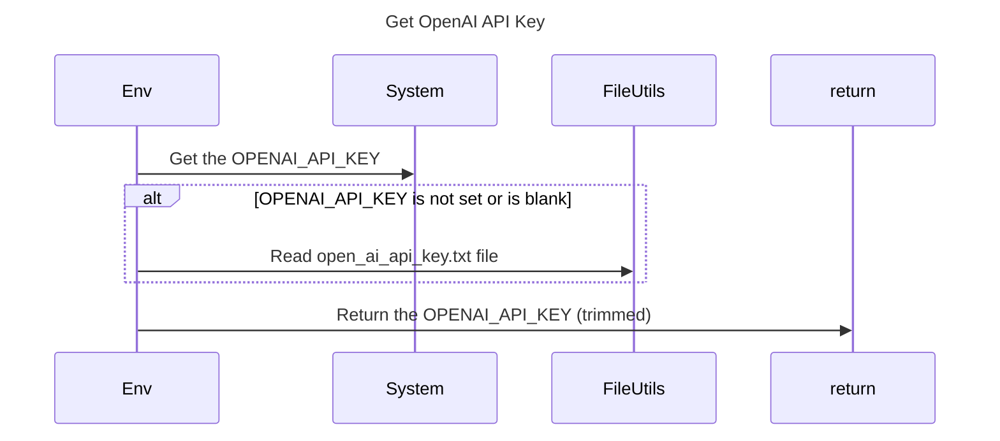

----
# FIX RAW RESPONSE 3
# Fix Instructions

## Participants

Desirable Participants:
- Env
- System
- FileUtils

## Validation Fixes

There is 1 validation issue in the broken mermaid sequence diagram. To fix the issue, the violated line needs to be modified to remove the method call description.

## Interaction After Fix

The interaction after fixing the validation issue would be as follows:
- Env requests the OPENAI_API_KEY from the System.
- If the OPENAI_API_KEY is not set or is blank, Env reads the open_ai_api_key.txt file using FileUtils.
- The OPENAI_API_KEY (trimmed) is returned.

## Final Participants

The final list of participants after fixing the issues would be:
- Env
- System
- FileUtils

## Plain English Title

Get OpenAI API Key

## Mermaid Sequence Diagram

