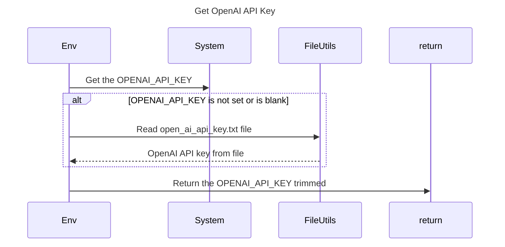

----
# FIX RAW RESPONSE 2
# Participants

- Env
- System
- FileUtils

# Validation Fixes

## No Method Calls In Descriptions Rule (Line 13)
Replace `Env ->> return: Return the OPENAI_API_KEY (trimmed)` with `Env ->> return: Return the OPENAI_API_KEY trimmed`.

# Interaction After Fix

- Env ->> System: Get the OPENAI_API_KEY
- alt OPENAI_API_KEY is not set or is blank
  - Env ->> FileUtils: Read open_ai_api_key.txt file
  - FileUtils -->> Env: OpenAI API key from file
- end
- Env ->> return: Return the OPENAI_API_KEY trimmed

# Final Participants

- Env
- System
- FileUtils

# Plain English Title
Get OpenAI API Key

# Mermaid Sequence Diagram

