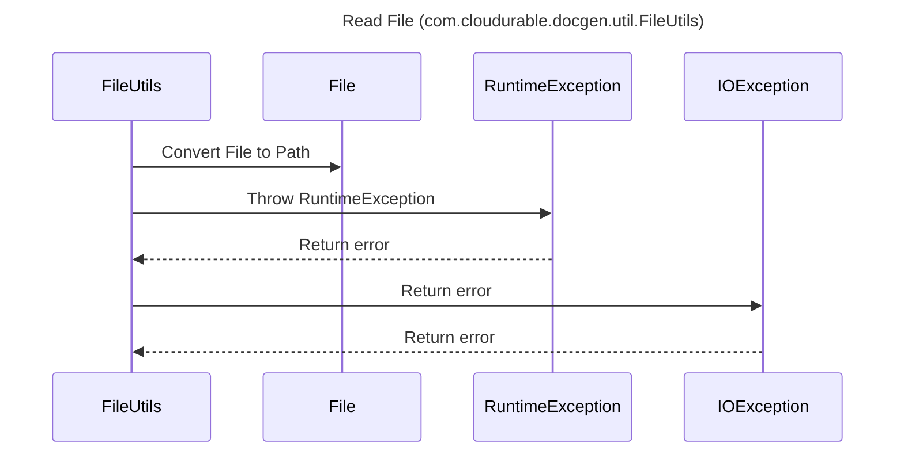

----
# ORIGINAL RESPONSE 
# Participants

1. FileUtils
2. File
3. RuntimeException
4. IOException

# Initial Interactions

- FileUtils reads a file

# Clean Interactions

- FileUtils->>File: Convert File to Path
- FileUtils->>Files: Read File
- alt File is read successfully
  - Files-->>FileUtils: Return file content
- else File read operation fails
  - FileUtils-->>RuntimeException: Throw RuntimeException
  - RuntimeException-->>FileUtils: Return error

# Final Participants

- FileUtils
  - `Convert File to Path`
  - `Read File`
  - `Return file content`
  - `Throw RuntimeException`
  - `Return error`
- File
- RuntimeException
- IOException

# Plain English Title

Read File (com.cloudurable.docgen.util.FileUtils)

# Mermaid Sequence Diagram

