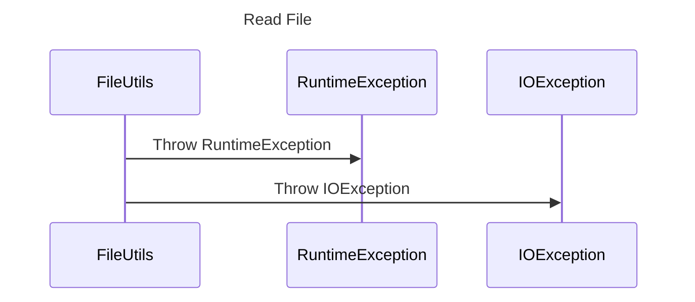

----
# FIX RAW RESPONSE 3
# Participants

1. FileUtils
2. File
3. RuntimeException
4. IOException

# Validation Fixes

## Primitive Rule
### Issue Description
The line contains the participant "File", which is a primitive or basic data type that is not allowed in the sequence diagram.

### Fix
Remove the participant "File" and replace it with a more appropriate participant.

## Primitive Rule
### Issue Description
The line contains the participant "Convert File to Path", which is a primitive or basic data type that is not allowed in the sequence diagram.

### Fix
Replace the participant "Convert File to Path" with a more appropriate participant.

# Interaction After Fix

1. FileUtils converts the File to a Path.

# Final Participants

1. FileUtils
2. RuntimeException
3. IOException

# Plain English Title

Read File

# Mermaid Sequence Diagram

