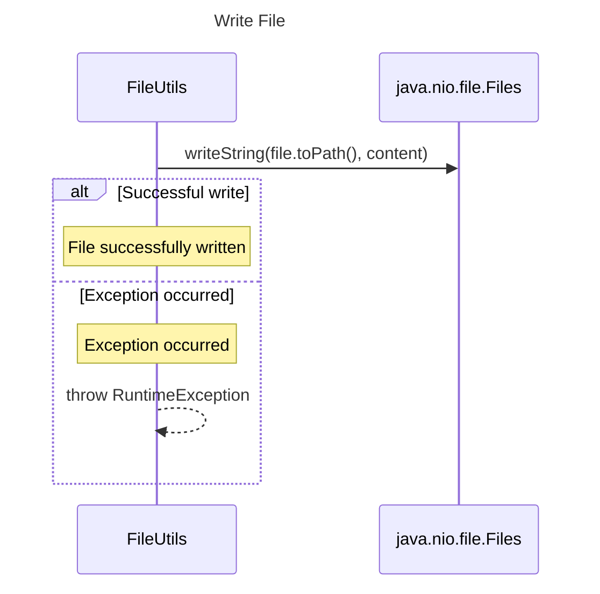

----
# ORIGINAL RESPONSE 
# Participants

1. `FileUtils`
2. `java.io.File`
3. `java.nio.file.Files`

# Initial Interactions

- `FileUtils` writes content to a file using `writeFile` method.

# Clean Interactions

- `FileUtils` calls `writeString` method of `java.nio.file.Files` to write content to a file.
- `writeString` method is called with arguments `file.toPath()` and `content`.
- In case of an exception, an `Exception` is caught and a `RuntimeException` is thrown.

# Final Participants

- `FileUtils`
  - `writeString` method of `java.nio.file.Files`

# Plain English Title

Write File

# Mermaid Sequence Diagram

