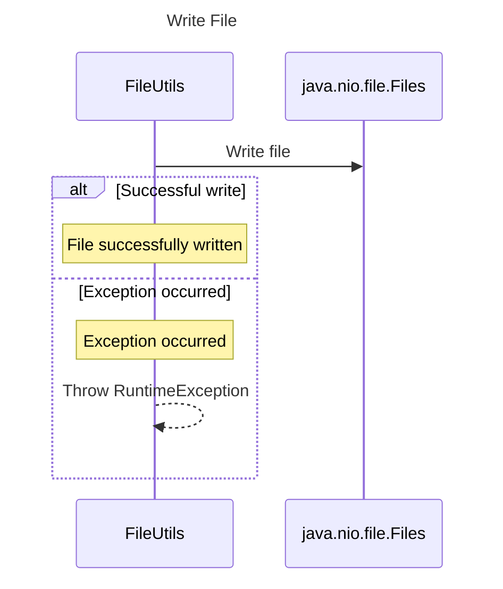

----
# FIX RAW RESPONSE 3
# Participants
The participants for the sequence diagram are:

1. FileUtils
2. java.nio.file.Files

# Validation Fixes
Based on the validation issues, the following fixes need to be applied:

1. Remove method calls in the description: Update the description for the interaction to remove method calls. For example, change "FileUtils->>java.nio.file.Files: writeString(file.toPath(), content)" to "FileUtils->>java.nio.file.Files: Write file".
2. Remove notes: Remove the note over FileUtils for successful write and Exception occurred.

# Interaction After Fix
After applying the fixes, the interactions are as follows:

1. FileUtils->>java.nio.file.Files: Write file
2. alt Successful write
   - Note over FileUtils: File successfully written
3. else Exception occurred
   - Note over FileUtils: Exception occurred
   - FileUtils-->>FileUtils: Throw RuntimeException
4. end

# Final Participants
The final participants for the sequence diagram are:

1. FileUtils
2. java.nio.file.Files

# Plain English Title
The plain English title for the sequence diagram is "Write File".

# Mermaid Sequence Diagram

