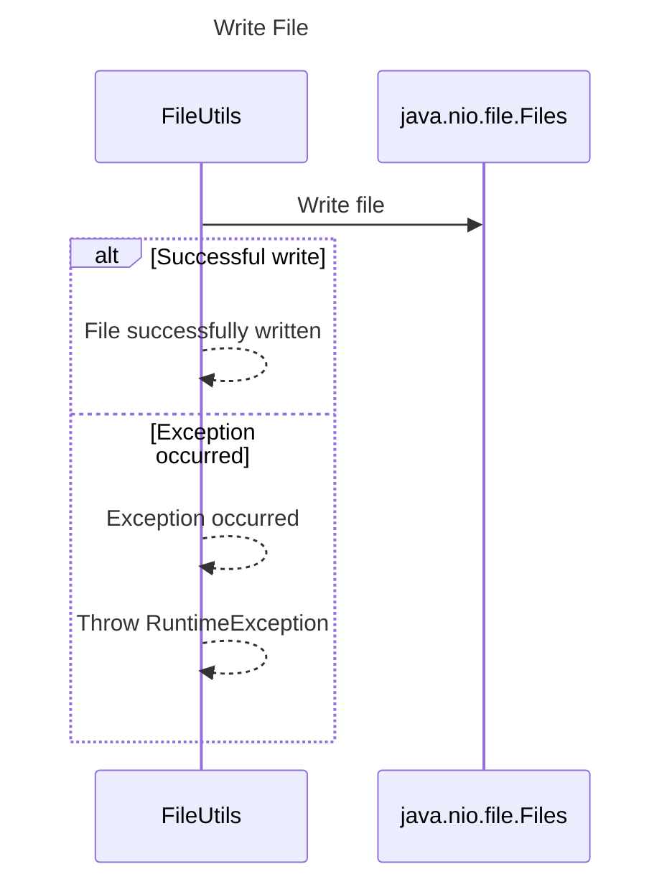

----
# FIX RAW RESPONSE 2
# Participants

- FileUtils
- java.nio.file.Files

# Validation Fixes

- Remove the `Note over` statements from lines 10 and 12. Encapsulate the necessary information within the interaction sequence.

# Interaction After Fix

- FileUtils calls java.nio.file.Files to write the file.
- If the write operation is successful, FileUtils completes the operation successfully.
- If an exception occurs, FileUtils throws a RuntimeException.

# Final Participants

- FileUtils
- java.nio.file.Files

# Plain English Title

Write File

# Mermaid Sequence Diagram

