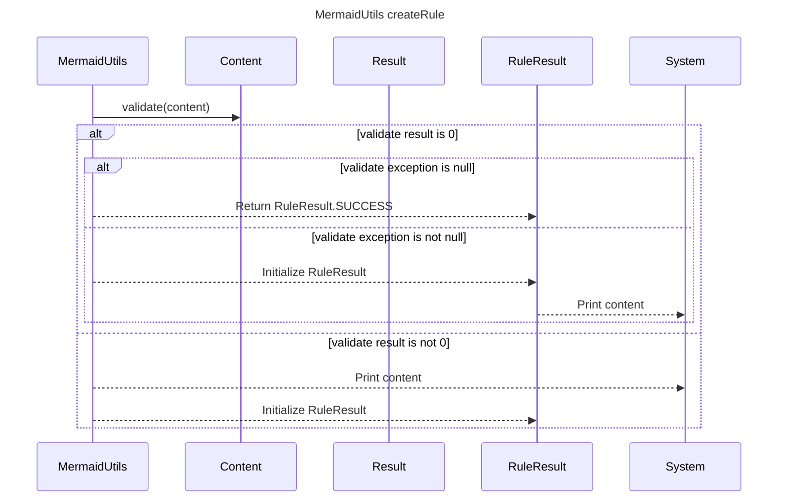

----
# ORIGINAL RESPONSE 
# Participants

* MermaidUtils
* Content
* Result
* RuleResult

# Initial Interactions

* `MermaidUtils` calls `validate` method with `content` as parameter
* Check if `validate` result is equal to 0
* Check if `validate` exception is null
* If `validate` result is 0 and exception is null, return `RuleResult.SUCCESS`
* If `validate` result is not 0 or exception is not null
   * Split `validate` errors by `"   at te."`
   * If the length of errorParts is greater than 1, the first part is stored in `errors`, otherwise, the entire `validate.errors` is stored in `errors`
   * Print `content`
   * Return `RuleResult` with the description set to "mermaid image generator failed \n" + `errors`, lineNumber set to 0, violatedLine set to "", and ruleName set to "MermaidImageGen"

# Clean Interactions

* `MermaidUtils` calls `validate` method with `content` as parameter
* `validate` returns `Result` object
* Check if `validate` result is equal to 0
* Check if `validate` exception is null
* Return `RuleResult.SUCCESS`
* Split `validate` errors by `"   at te."`
* Print `content`
* Return `RuleResult` with the description set to "mermaid image generator failed \n" + `errors`, lineNumber set to 0, violatedLine set to "", and ruleName set to "MermaidImageGen"

# Final Participants

* MermaidUtils
   * `MermaidUtils` calls `validate` method with `content` as parameter
   * Check if `validate` result is equal to 0
   * Check if `validate` exception is null
   * If `validate` result is 0 and exception is null, return `RuleResult.SUCCESS`
   * If `validate` result is not 0 or exception is not null
      * Split `validate` errors by `"   at te."`
      * If the length of errorParts is greater than 1, the first part is stored in `errors`, otherwise, the entire `validate.errors` is stored in `errors`
      * Print `content`
      * Return `RuleResult` with the description set to "mermaid image generator failed \n" + `errors`, lineNumber set to 0, violatedLine set to "", and ruleName set to "MermaidImageGen"
   * Print `content`
   * Return `RuleResult` with the description set to "mermaid image generator failed \n" + `errors`, lineNumber set to 0, violatedLine set to "", and ruleName set to "MermaidImageGen"
* Content
* Result
   * Returns the result of `validate`
* RuleResult
   * Represents the result of the validation rule

# Plain English Title
`MermaidUtils createRule`

# Mermaid Sequence Diagram

