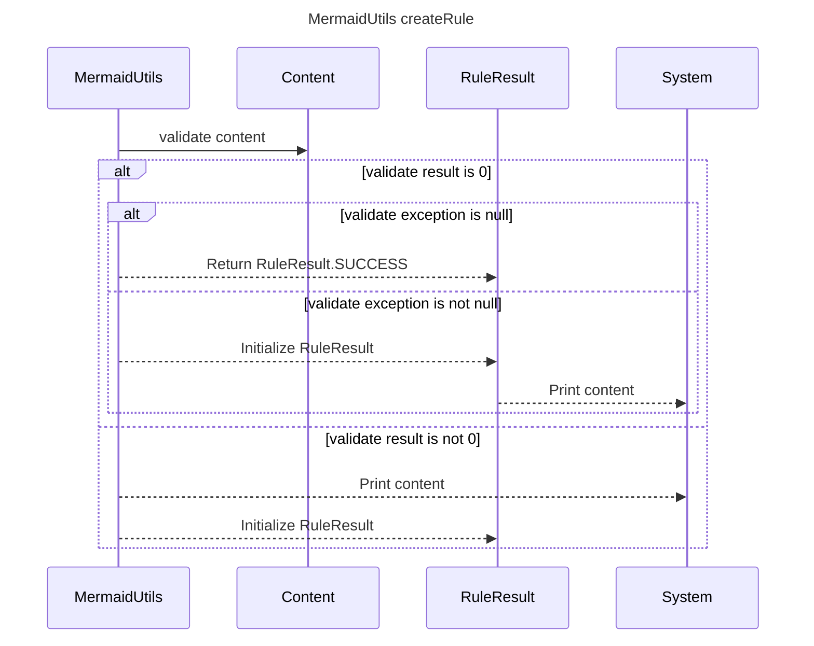

----
# FIX RAW RESPONSE 3
# Participants

- MermaidUtils
- Content
- Result
- RuleResult
- System

# Validation Fixes
The `No Method Calls In Descriptions Rule` validation issue in line 10 needs to be fixed. Instead of `MermaidUtils->>Content: validate(content)`, it should be `MermaidUtils->>Content: validate content`.

# Interaction After Fix

1. MermaidUtils sends a validation request to Content.
2. If the validate result is 0:
   - If the validate exception is null, MermaidUtils returns RuleResult.SUCCESS to RuleResult.
   - If the validate exception is not null, MermaidUtils initializes RuleResult and RuleResult sends the content to System for printing.
3. If the validate result is not 0, MermaidUtils sends the content to System for printing and initializes RuleResult.

# Final Participants

- MermaidUtils
- Content
- RuleResult
- System

# Plain English Title

MermaidUtils createRule

# Mermaid Sequence Diagram

