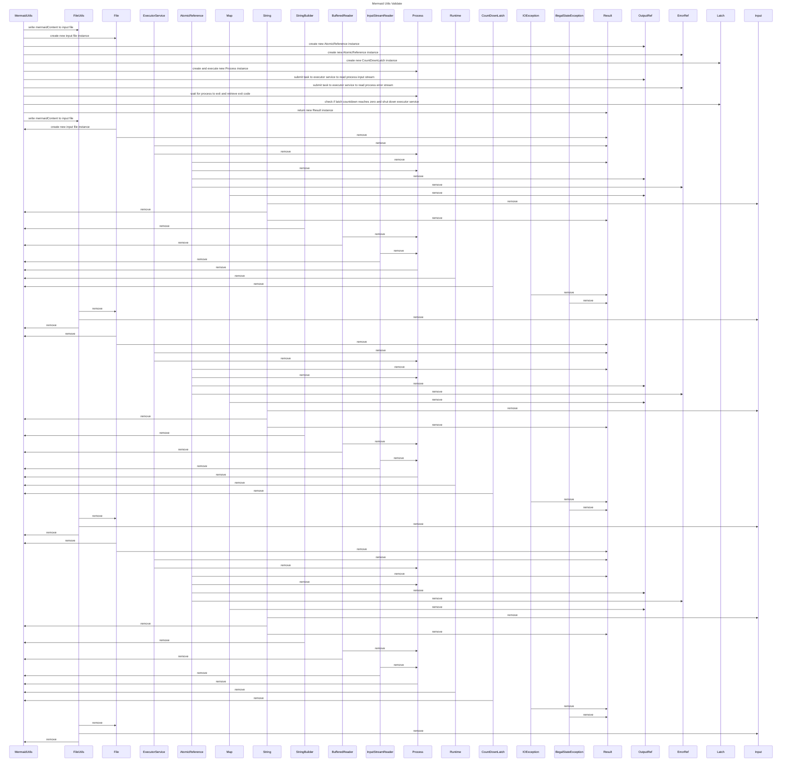

----
# ORIGINAL RESPONSE 
# Participants

- MermaidUtils
- File: java.io.File
- ExecutorService: java.util.concurrent.ExecutorService
- AtomicReference: java.util.concurrent.atomic.AtomicReference
- Map: java.util.Map
- String: java.lang.String
- StringBuilder: java.lang.StringBuilder
- BufferedReader: java.io.BufferedReader
- InputStreamReader: java.io.InputStreamReader
- Process: java.lang.Process
- Runtime: java.lang.Runtime
- CountDownLatch: java.util.concurrent.CountDownLatch
- IOException: java.io.IOException
- IllegalStateException: java.lang.IllegalStateException
- Result: com.cloudurable.docgen.util.MermaidUtils.Result
- FileUtils: com.cloudurable.docgen.util.FileUtils

# Initial Interactions

- MermaidUtils calls `FileUtils.writeFile()`
- MermaidUtils initializes a new `File` instance
- MermaidUtils initializes a new `AtomicReference<StringBuilder>` instance
- MermaidUtils initializes a new `AtomicReference<StringBuilder>` instance
- MermaidUtils initializes a new `CountDownLatch` instance
- MermaidUtils creates and executes a new `Process` instance using `Runtime.getRuntime().exec()`
- MermaidUtils submits a task to the executor service that reads the process input stream and appends it to the output builder
- MermaidUtils submits a task to the executor service that reads the process error stream and appends it to the error builder
- MermaidUtils waits for the process to exit and retrieves the exit code
- MermaidUtils checks if the latch countdown reaches zero and shuts down the executor service
- MermaidUtils returns a new `Result` instance

# Clean Interactions

- MermaidUtils calls `FileUtils.writeFile` to write the `mermaidContent` to the `input` file
- MermaidUtils initializes a new `File` instance for the `input` file
- MermaidUtils initializes a new `File` instance for the `output` file
- MermaidUtils initializes a new `AtomicReference<StringBuilder>` instance for the `outputRef`
- MermaidUtils initializes a new `AtomicReference<StringBuilder>` instance for the `errorRef`
- MermaidUtils initializes a new `CountDownLatch` instance with a count of 2 for the `latch`
- MermaidUtils creates a command string representing the mermaid diagram conversion using `mmdc`
- MermaidUtils creates a new `ExecutorService` for managing the concurrent tasks
- MermaidUtils starts a new process to execute the command string using `Runtime.getRuntime().exec`
- MermaidUtils submits a task to the executor service that reads the process input stream and appends it to the `outputRef`
- MermaidUtils submits a task to the executor service that reads the process error stream and appends it to the `errorRef`
- MermaidUtils waits for the process to exit and retrieves the exit code using `process.waitFor()`
- MermaidUtils checks if the latch countdown reaches zero within a timeout period of 30 seconds using `latch.await()`
- MermaidUtils shuts down the executor service
- MermaidUtils returns a new `Result` instance

# Final Participants

- MermaidUtils
  - Initial Interactions
  - Clean Interactions
- File: java.io.File
  - Initial Interactions
  - Clean Interactions
- ExecutorService: java.util.concurrent.ExecutorService
  - Initial Interactions
  - Clean Interactions
- AtomicReference: java.util.concurrent.atomic.AtomicReference
  - Initial Interactions
  - Clean Interactions
- Map: java.util.Map
  - Remove
- String: java.lang.String
  - Initial Interactions
  - Clean Interactions
- StringBuilder: java.lang.StringBuilder
  - Initial Interactions
- BufferedReader: java.io.BufferedReader
  - Initial Interactions
- InputStreamReader: java.io.InputStreamReader
  - Initial Interactions
- Process: java.lang.Process
  - Initial Interactions
- Runtime: java.lang.Runtime
  - Initial Interactions
- CountDownLatch: java.util.concurrent.CountDownLatch
  - Initial Interactions
- IOException: java.io.IOException
  - Initial Interactions
- IllegalStateException: java.lang.IllegalStateException
  - Initial Interactions
- Result: com.cloudurable.docgen.util.MermaidUtils.Result
  - Initial Interactions
- FileUtils: com.cloudurable.docgen.util.FileUtils
  - Initial Interactions

# Plain English Title

Mermaid Utils Validate

# Mermaid Sequence Diagram

