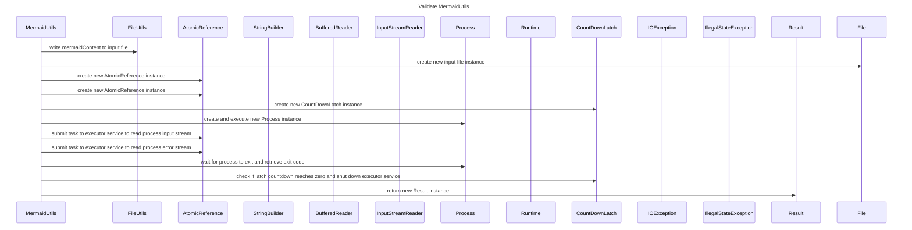

----
# FIX RAW RESPONSE 3
# Participants

- MermaidUtils
- FileUtils
- File
- ExecutorService
- AtomicReference
- Map
- StringBuilder
- BufferedReader
- InputStreamReader
- Process
- Runtime
- CountDownLatch
- IOException
- IllegalStateException
- Result

# Validation Fixes

- Remove primitive or basic data types as participants (File, Map, String).
- Replace specific words (byte, float, int, double, long, boolean, char) with ~.
- Remove square brackets.

# Final Participants

- MermaidUtils
- FileUtils
- AtomicReference
- StringBuilder
- BufferedReader
- InputStreamReader
- Process
- Runtime
- CountDownLatch
- IOException
- IllegalStateException
- Result

# Plain English Title

Validate MermaidUtils

# Mermaid Sequence Diagram
