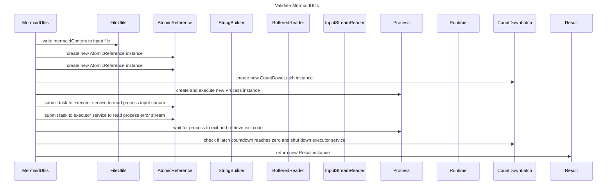

----
# FIX RAW RESPONSE 2
# Participants

1. MermaidUtils
2. FileUtils
3. AtomicReference
4. StringBuilder
5. BufferedReader
6. InputStreamReader
7. Process
8. Runtime
9. CountDownLatch
10. IOException
11. IllegalStateException
12. Result

# Validation Fixes

1. Primitive Rule violation on line 19
   - Violated line: `MermaidUtils->>File: create new input file instance`
   - Fix: Remove the participant `File` from the interaction.

# Interaction After Fix

1. `MermaidUtils->>FileUtils: write mermaidContent to input file`
2. `MermaidUtils->>AtomicReference: create new AtomicReference instance`
3. `MermaidUtils->>AtomicReference: create new AtomicReference instance`
4. `MermaidUtils->>CountDownLatch: create new CountDownLatch instance`
5. `MermaidUtils->>Process: create and execute new Process instance`
6. `MermaidUtils->>AtomicReference: submit task to executor service to read process input stream`
7. `MermaidUtils->>AtomicReference: submit task to executor service to read process error stream`
8. `MermaidUtils->>Process: wait for process to exit and retrieve exit code`
9. `MermaidUtils->>CountDownLatch: check if latch countdown reaches zero and shut down executor service`
10. `MermaidUtils->>Result: return new Result instance`

# Final Participants

1. MermaidUtils
2. FileUtils
3. AtomicReference
4. StringBuilder
5. BufferedReader
6. InputStreamReader
7. Process
8. Runtime
9. CountDownLatch

# Plain English Title
"Validate MermaidUtils"

# Mermaid Sequence Diagram

