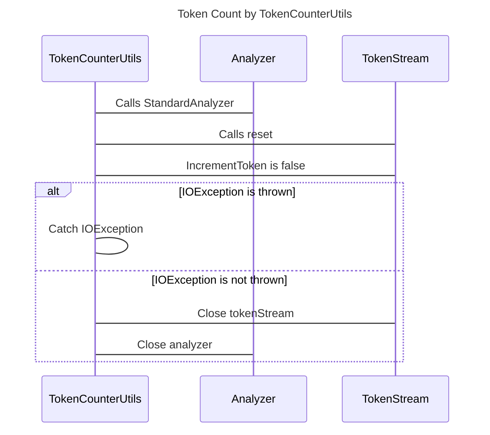

----
# FIX RAW RESPONSE 2
# Participants

Participants:
- TokenCounterUtils
- Analyzer
- TokenStream
- IOException

# Validation Fixes

1. Remove line number and violated line information from the validation JSON.
2. Fix the description in the validation JSON by removing the parse error message.

# Interaction After Fix

- TokenCounterUtils calls StandardAnalyzer.
- TokenCounterUtils calls reset on TokenStream.
- TokenStream returns false for the incrementToken call.
- TokenCounterUtils returns the tokenCount multiplied by 0.3 plus tokenCount from TokenStream.
- If an IOException is thrown, TokenCounterUtils catches it and prints the stack trace.
- TokenCounterUtils closes TokenStream.
- TokenCounterUtils closes Analyzer.

# Final Participants

Participants:
- TokenCounterUtils
- Analyzer
- TokenStream

# Plain English Title

Title: Token Count by TokenCounterUtils

# Mermaid Sequence Diagram

