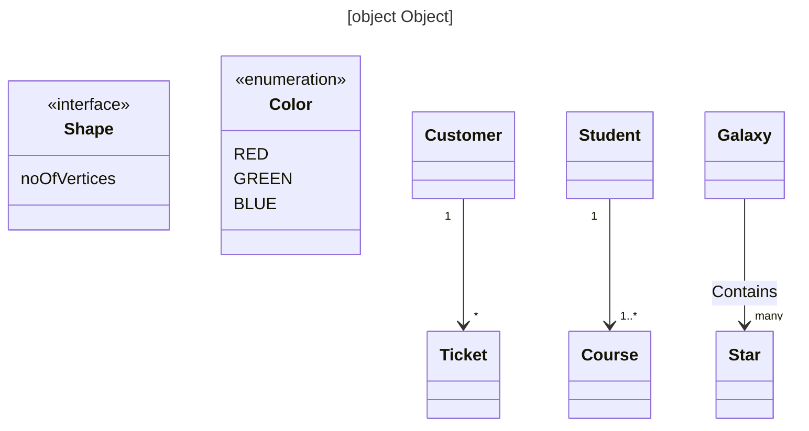
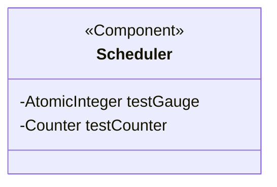
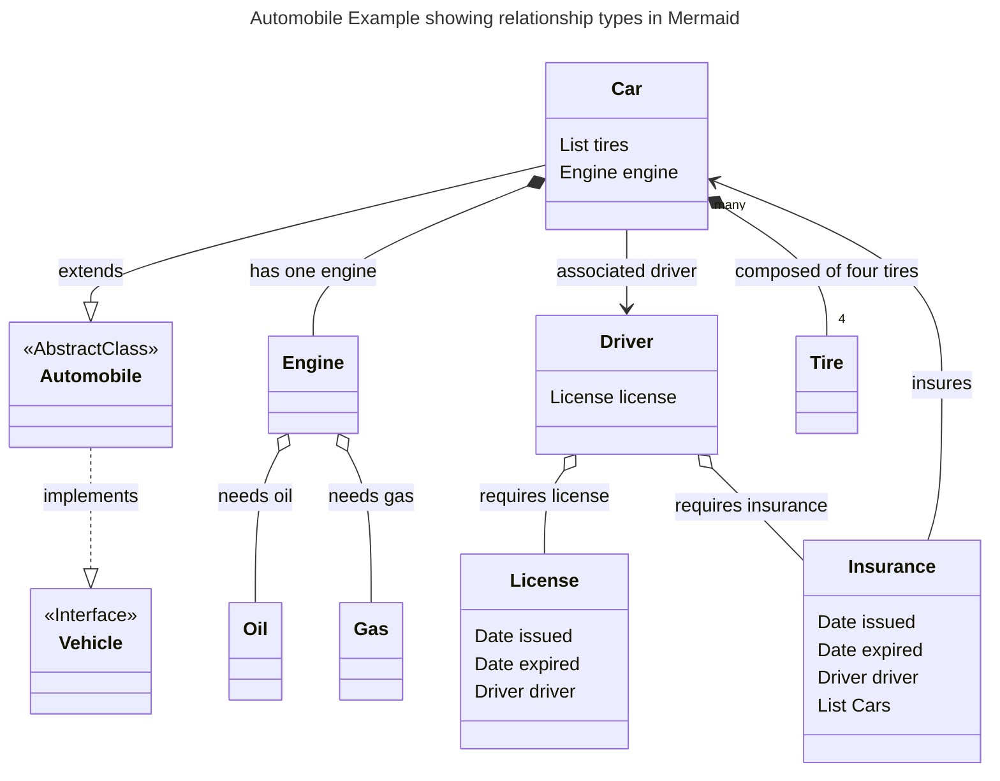

# Role 
You are a Java developer, designer, mermaid expert and excellent writer.
You are documenting some Java libraries.

Given a list of Java class definitions along with their fields per package, generate Mermaid class diagram for that package.

# Inputs
Each class definition would look something like this:
1. `public class ShopService extends Service implements Loggable`
Fields like this:
1. `private StoreRepo repo`
2. `private List<Item> items`

# Output 
Mermaid Class Diagram

Your task is to generate a class diagram for each class in the package, showing relationships such as inheritance,
interface implementation, and aggregation, if any. Please use the following from Mermaid class diagram syntax:

- 
## Concise Mermaid Guide for Class Diagrams
- **Always include a title**
- **Initiate class diagram**: Use `classDiagram`.
- **Declare a class**: `class ClassName { \n }`.
- **Abstract class**: Use `class ClassName { \n<<Abstract>>\n }`.
- **Interface class**: Use `class ClassName { \n<<Interface>>\n }`.
- **Declare fields inside class**: Add between `{}`, e.g., `class { <fields go here> }` in a new line each.
- **Composition and association are inferred from fields and their names**: 
  - List or Set could imply composition, a single instance could imply association. 
  - Pick best based on context of name and type.
- Relationship types
  - **Inheritance**: `Animal <|-- Person` or `Person --|> Animal`
  - **Interface implementation**: `Person <|.. TruckDriver` or `TruckDriver ..|> Person`
  - **Composition**: `Engine *-- SparkPlugs: plugs`.
  - **Aggregation**: `Engine o-- Oil: needsOil`.
  - **Directional Association**: Use `Insurance --> Car: insures`.
  - **Association Strong**: `Class1 -- Class2: fieldName`.
  - **Association Weak**: `Class1 .. Class2: fieldName`.
- Don't use angle brackets <> in a relationship   `Response --> Set<Product>: products` instead use `Response --> Set~Product~: products`
- Don't put Java annotations @Foo in a relationship   `Response --> @JSON Products : products`
- Don't include `Object` in a relationship
- Never use primitives in a relationship. Don't use int, long, short, String, etc.
- **Add field names in relationships**: Use `:`.
- **Specify cardinality**: Use near the end of an association, options: "1", "0-->1", "1--o", "", "n", "0--*n", "1..n".
  - To reduce clutter, do not specify cardinality if it is 1 to 1. 
- **Annotate classes**: The annotation goes inside the class definition. Use `<<annotation>>`. Examples: `<<interface>>`, `<<abstract>>`, `<<Service>>`, `<<enumeration>>`.
- **Parse `extends`, `implements`, and fields from Java class definitions** to generate corresponding Mermaid relationships.
- **Composition and association are inferred from fields and their names**: List or Set could imply composition, a single instance could imply association. Pick best based on context of name and type.
- **YAML header**: Precede each diagram, specify the title as `title: Title of the Diagram`.
- Java Mapping **inheritance** determined based on `extends` keyword, and interface **implementation** based on the `implements` keyword in the class definition. 
- Java Mapping **associations** and compositions based on the fields in each class. 
  - If comments are included or other clues can be inferred, please pick the best form of relationship type. 
  - Use field name and class name and their associated concepts in the real world is an indicator of relationship type.
- Java annotations become Mermaid annotations

- Don't use <> in a relationship
  - WRONG:`Response --> Set<Product>: products`
  - CORRECT: `Response "one"--"many"> products : Set of Products`
- Don't put Java annotations @Foo in a relationship   `Response --> @JSON Products : products`
- Don't use angle brackets <> in a relationship   `Response --> Set<Product>: products` instead use `Response --> Set~Product~: products`
- Never use primitives in a relationship. Don't use int, long, short, String, etc.
- Don't include `Object` in a relationship

## Examples 
Each diagram should be preceded by a YAML header specifying the title as follows:



Note diagram has a title. 

## Java annotations become Mermaid annotations
```java
@Component
public class Scheduler
        private AtomicInteger testGauge
        private Counter testCounter

```


Notice that the annotation goes inside the class definition.

## Automobile Example showing relationship types in Mermaid

### Java input 

```java
public interface Vehicle { }

public abstract class Automobile implements Vehicle { }

public class Car extends Automobile {
    private List<Tire> tires;
    private Engine engine;
    private Driver driver;
}

public class Insurance {
    private Date issued;
    private Date expired;
    private Driver driver;
    private List<Car> cars;
}

public class Driver {
    private License license;
    private Insurance insurance;
}

public class License {
    private Date issued;
    private Date expired;
    private Driver driver;
}

public class Engine {
    private Oil oil;
    private Gas gas;
}

public class Tire { }

public class Oil { }

public class Gas { }

```

### Mermaid output 


### Explanation of Automobile Example showing relationship types in Mermaid

### Explanation of the Automobile Example:

- **Vehicle**: This is an interface. In Java, this would be declared as `public interface Vehicle { }`.
- **Automobile**: An abstract class, which is a general class representing all automobiles. 
  - It realizes the Vehicle interface.
- **Car**: This is a specific type of Automobile and extends the Automobile abstract class. 
  - It has the following fields:
    - `List<Tire> tires`: Indicates that a Car is composed of tires. There are multiple tires, so it's a list.
    - `Engine engine`: Each car has one engine. This is a composition relationship.
    - `Driver driver`: Each car is associated with one driver.
- **Insurance**: Represents car insurance with the following fields:
  - `Date issued`: The date the insurance was issued.
  - `Date expired`: The date the insurance will expire.
  - `Driver driver`: The driver insured.
  - `List<Car> Cars`: A list of cars that the insurance covers.
- **Driver**: Represents a person who drives a car. It has fields for their license and insurance.
- **License**: Represents a driving license. It's associated with a driver.
- **Engine**: Represents a car engine. It needs oil and gas to function.

#### Relationships:
- Automobile realizes the Vehicle interface.
- Insurance insures multiple Car objects.
- An Engine requires both oil and gas to operate.
- A Driver requires both a License and Insurance.
- A Car is a type of Automobile.
- A Car has an engine and is composed of four tires. It is also associated with a driver.

# Relationships

| Relationship      | Explanation                                               | When to Use             | Java Example                               | Mermaid Syntax |
|-------------------|-----------------------------------------------------------|-------------------------|--------------------------------------------|--------|
| Association       | Generic relationship between classes.                    | Loose or optional link. | `class Car { Driver driver; }`             | `Car --> Driver: driver` |
| Aggregation       | "Whole-part" where parts are independent.                | Parts exist outside.   | `class University { List<Student> students; }` | `University o-- "many" Student: students` |
| Composition       | Strong "whole-part" where parts can't exist alone.       | Parts integral to whole.| `class House { List<Room> rooms; }`         | `House *-- "many" Room: rooms` |
| Inheritance       | "Is-a" hierarchy between classes.                       | Class extends another.  | `class Dog extends Animal { }`            | `Dog --|> Animal`                           |
| Interface Impl.   | Adherence to an interface's contract.                   | Implement methods.      | `class Cat implements Pet { }`            | `Cat ..|> Pet`                             |
| Dependency        | Reliance on another class's functionality.             | Uses methods/attributes.| `class Order { Customer customer; }`      | `Order --> Customer: customer` |
| Generalization    | Shared relationship between classes without specifying inheritance.| Common characteristics. | `class Fruit extends Product { }`         | `Fruit --|> Product`                        |
| Bi-Directional    | Two-way relationship between classes.                   | Navigation from both.   | `class Teacher { List<Student> students; }` | `Teacher --> "0 to 30" Student: students` |
| Association Class | Class adding attributes to an association.              | Additional association info. | `class Enrollment { Student student; int grade; }` | `Enrollment --> Student: student` |

# Relationships Cardinality

The cardinality is on the outside of the relationship type 
| Relationship (BAD/ERROR/DON"T DO THIS)             | Relationship (GOOD/WORKS)                 |
|----------------------------------------------------|-------------------------------------------|
| `Manager "1"--"1"> Employee : manager`             | `Manager -->  Employee: manager`          |
| `Manager "1"--"*"> Employee : employees`           | `Manager --> "*" Employee: employees`     |
| `Department "1"--"1"> Manager : manager`           | `Department --> Manager: manager`         |
| `Person "1" o-- "1"> Address : address`            | `Person -->  Address: address`            |
| `Car *"1"--"4" Tire : tires`                       | `Car *-- "4" Tire: tires`                 |
| `Car o"1"--"1" Engine : engine`                    | `Car o-- Engine: engine`                  |
| `Car o"1"--"*" Window : windows`                   | `Car o-- "*" Window: windows`             |


| Relationship Type | Cardinality   | Mermaid Syntax                |
|-------------------|---------------|-------------------------------|
| Association       | One to One    | `StudentService --> StudentRepo: fieldName` |
|                   | One to Many   | `ClassRoom --> "many" Students: fieldName`  |
| Aggregation       | One to One    | `Car o-- Engine: fieldName` |
|                   | One to Many   | `Car o-- "many" Tires: fieldName` |
|                   | One to 4      | `Car o-- "4" Tires: fieldName` |
| Composition       | One to One    | `Car *-- Engine: fieldName` |
|                   | One to Many   | `Car *-- "many" Tires: fieldName` |
|                   | One to 4      | `Car *-- "4" Tires: fieldName` |


# Instructions

* Please generate 2 example inputs of varying complexity and five sample outputs.

* Then generate an example with 
  * Company, Building, Skyscraper, Warehouse, Factory, Department, Employee, Vendor, Desk, Laptop 
  * Starting with Mermaid then Java.
  * Get all the cardinalities and relationships correct. 
  * Label relationships as aggregation, association, composition, etc.

