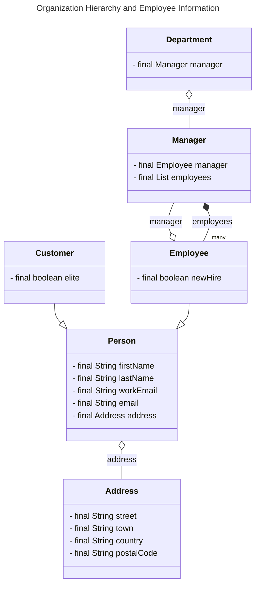

# Plain English Title
Organization Hierarchy and Employee Information

# Class Details List
* Manager
    * Fields:
        * final Employee manager
        * final List<Employee> employees
* Customer extends Person
    * Fields:
        * final boolean elite
* Department
    * Fields:
        * final Manager manager
* Address
    * Fields:
        * final String street
        * final String town
        * final String country
        * final String postalCode
* Person
    * Fields:
        * final String firstName
        * final String lastName
        * final String workEmail
        * final String email
        * final Address address
* Employee extends Person
    * Fields:
        * final boolean newHire

# Relationship Details List
* Manager has Association relationship with Employee
    * The Manager class has a final field of type Employee, indicating that a manager has a direct association with an employee.
* Manager has Composition relationship with Employee
    * The Manager class also has a final field of type List<Employee>, indicating that a manager can manage multiple employees. This is a composition relationship as the employees cannot exist independently and are an integral part of the manager.
* Customer has Inheritance relationship with Person
    * The Customer class extends the Person class, indicating that a customer is a specific type of person. This is an inheritance relationship as the customer class inherits the attributes and behaviors of the person class.
* Department has Composition relationship with Manager
    * The Department class has a final field of type Manager, indicating that a department has a manager. This is a composition relationship as the manager cannot exist independently and is an integral part of the department.
* Person has Composition relationship with Address
    * The Person class has a final field of type Address, indicating that a person has an address. This is a composition relationship as the address cannot exist independently and is an integral part of the person.
* Employee has Inheritance relationship with Person
    * The Employee class extends the Person class, indicating that an employee is a specific type of person. This is an inheritance relationship as the employee class inherits the attributes and behaviors of the person class.

# Mermaid diagram
