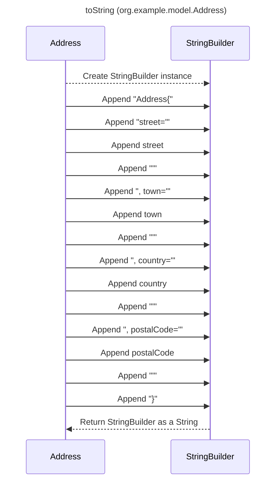

----
# ORIGINAL RESPONSE 
# Participants

1. Address
2. StringBuilder

# Initial Interactions

Address-->StringBuilder: Convert StringBuilder to a String

# Clean Interactions

Address-->>StringBuilder: Create StringBuilder instance
Address->>StringBuilder: Append "Address{"
Address->>StringBuilder: Append "street='"
Address->>StringBuilder: Append street
Address->>StringBuilder: Append "'"
Address->>StringBuilder: Append ", town='"
Address->>StringBuilder: Append town
Address->>StringBuilder: Append "'"
Address->>StringBuilder: Append ", country='"
Address->>StringBuilder: Append country
Address->>StringBuilder: Append "'"
Address->>StringBuilder: Append ", postalCode='"
Address->>StringBuilder: Append postalCode
Address->>StringBuilder: Append "'"
Address->>StringBuilder: Append "}"
StringBuilder-->>Address: Return StringBuilder as a String

# Final Participants

- Address
  - Convert StringBuilder to a String
  - Create StringBuilder instance
  - Append "Address{"
  - Append "street='"
  - Append street
  - Append "'"
  - Append ", town='"
  - Append town
  - Append "'"
  - Append ", country='"
  - Append country
  - Append "'"
  - Append ", postalCode='"
  - Append postalCode
  - Append "'"
  - Append "}"
- StringBuilder
  - Return StringBuilder as a String

# Plain English Title

toString (org.example.model.Address)

# Mermaid Sequence Diagram

