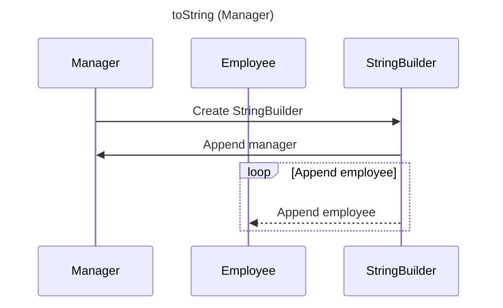

----
# ORIGINAL RESPONSE 
# Participants

1. Manager
2. Employee
3. StringBuilder

# Initial Interactions

- The `Manager` class has fields `manager` of type `Employee` and `employees` of type `List<Employee>`.
- The `Manager` class overrides the `toString` method.
- The `toString` method of `Manager` creates a `StringBuilder` object `sb` and appends the manager and employees' information.
- The `toString` method of `Manager` returns the string representation of the `StringBuilder` object.

# Clean Interactions

- `Manager` calls `StringBuilder` to create a new `StringBuilder` object (`StringBuilder->>Manager: Create StringBuilder`).
- `StringBuilder` appends the manager information (`StringBuilder->>Manager: Append manager`).
- `StringBuilder` appends the employees' information in a loop (`StringBuilder-->>Employee: Append employee`).

# Final Participants

- Manager
  - Create StringBuilder
  - Append manager
  - Append employee
  - REMOVE
  
- Employee
  - Append employee
  
- StringBuilder
  - Create StringBuilder
  - Append manager
  - Append employee

# Plain English Title

toString (Manager)

# Mermaid Sequence Diagram

