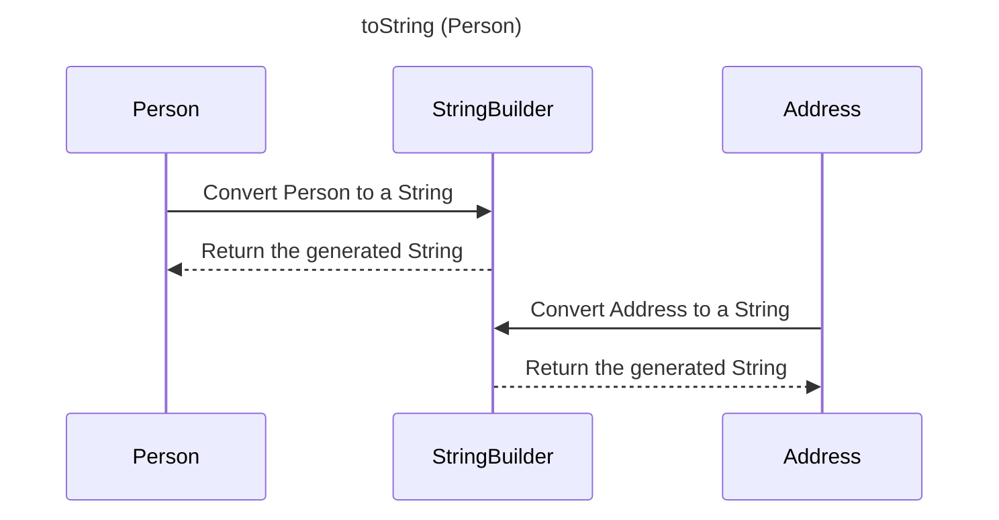

----
# ORIGINAL RESPONSE 
# Participants

- Person
- StringBuilder
- Address

# Initial Interactions

1. Person -> StringBuilder: Convert Person to a String
2. StringBuilder -->> Person: Return the generated String

# Clean Interactions

1. Person -> StringBuilder: Convert Person to a String
2. StringBuilder -->> Person: Return the generated String
3. Address -> StringBuilder: Convert Address to a String
4. StringBuilder -->> Address: Return the generated String

# Final Participants

- Person
  - Convert Person to a String
  - Return the generated String
- StringBuilder
- Address
  - Convert Address to a String
  - Return the generated String

# Plain English Title

toString (Person)

# Mermaid Sequence Diagram

