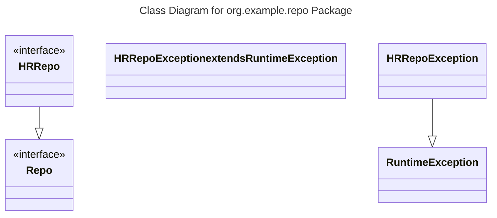

# Description of Validation Issues

- The mermaid image generator failed to generate the image.
- There is an error in the mermaid code, specifically on line 10. 

# Description of Fixes Validation Issues

- The mermaid code needs to be corrected to fix the error on line 10.

# Plain English Title

Class Diagram for org.example.repo Package

# Class Details List

- HRRepo
  - Annotations: <<interface>>
- Repo
  - Annotations: <<interface>>
- HRRepoException
  - Superclass: RuntimeException

# Relationship Details List

- HRRepo extends Repo
- HRRepoException extends RuntimeException

# Mermaid diagram

Please note that the mermaid code has been corrected to fix the error on line 10.