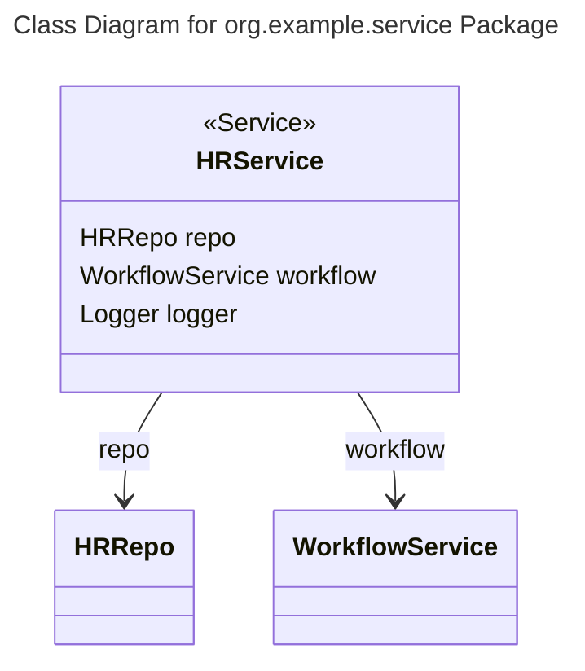

# Plain English Title
Class Diagram for org.example.service Package

## Class Details List
* HRService
     * Annotations:
         * @Service
     * Fields:
         * HRRepo repo
         * WorkflowService workflow
         * Logger logger

* WorkflowService
    * Fields: (no fields mentioned)

## Relationship Details List
* HRService has an Association relationship with HRRepo: The HRService class has a dependency on the HRRepo class since it uses an instance of HRRepo (repo field).
* HRService has an Association relationship with WorkflowService: The HRService class has a dependency on the WorkflowService class since it uses an instance of WorkflowService (workflow field).

## Mermaid Diagram

