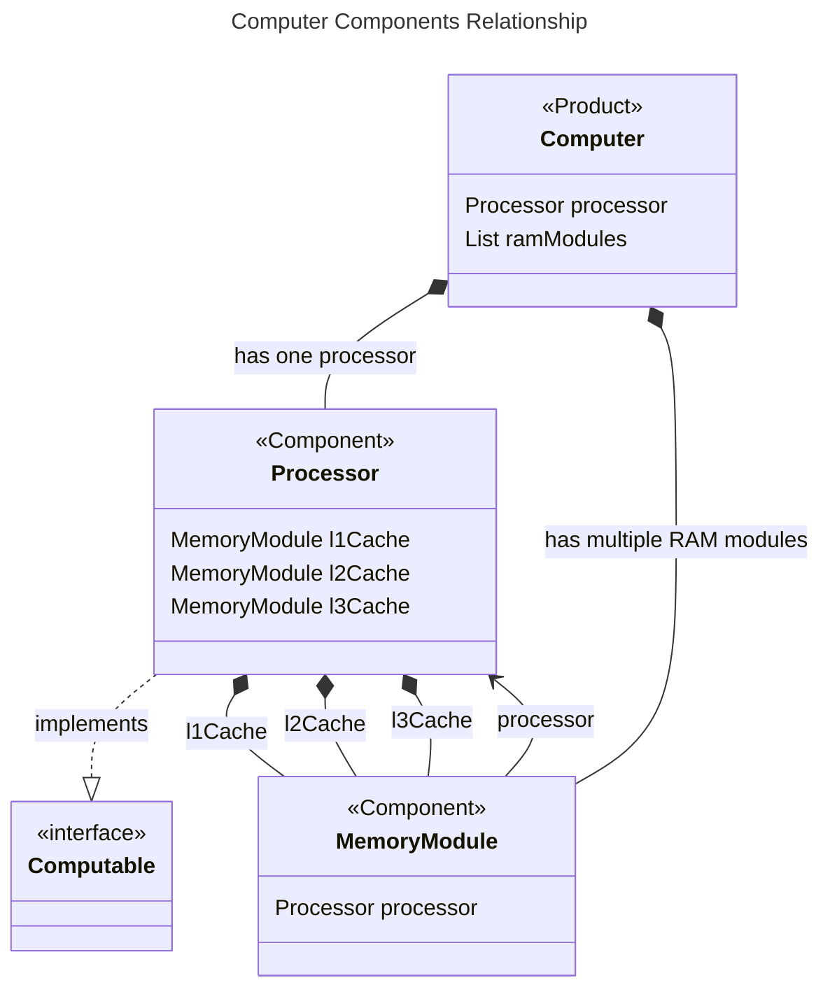
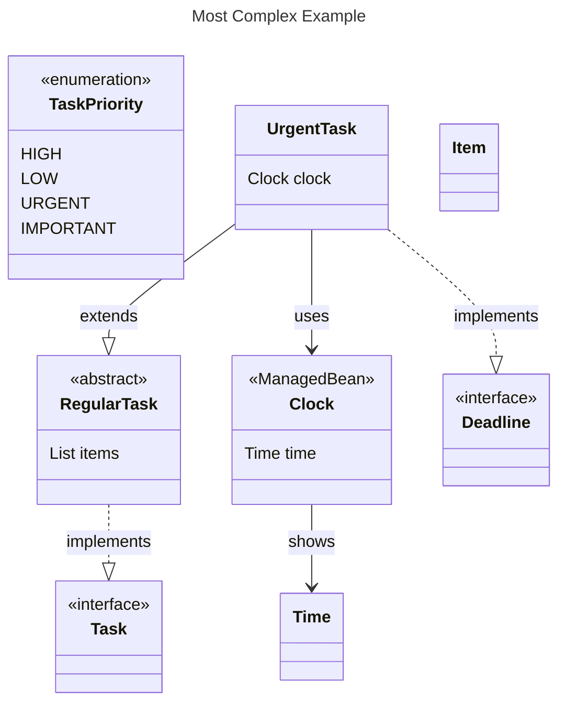
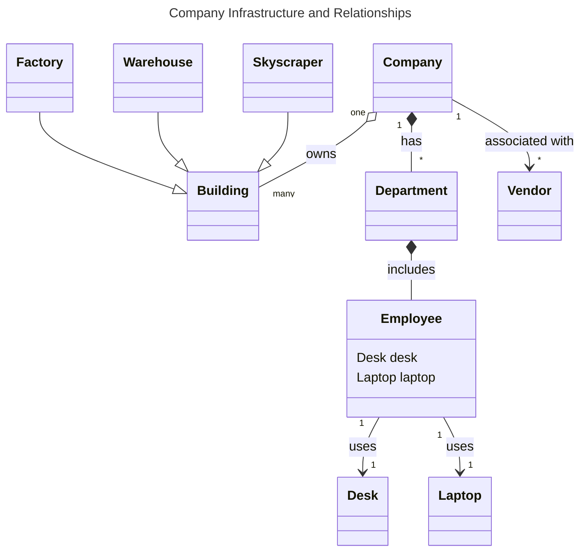

# Part 1: Generating examples 

## Java Input 1:

```java
public interface Computable { }

@Product 
public class Computer {
    private Processor processor;
    private List<MemoryModule> ramModules;
}

@Component
public class Processor { }

@Component
public class MemoryModule { }

```

## Mermaid Output 1:



## Java Input 2:

```java
@Component
public interface Task { }

public abstract class RegularTask implements Task {
    private List<Item> items;
}

public class UrgentTask extends RegularTask implements Deadline {
    private Clock clock;
}

@ManagedBean
public class Clock {
    private Time time;
}

public class Time {
}

public class Item {
}

public interface Deadline {
}

```

## Mermaid Output 2:




# Company Building Example 

## Company Infrastructure and Relationships

- **Building Types**:
    - `Skyscrapers`, `Warehouses`, and `Factories` are all types of `Buildings`.  (inheritance). 
    - While a company owns buildings, buildings can exist even without being associated with a company.

- **Ownership**:
    - A `Company` owns multiple types of `Buildings` such as `Skyscrapers`, `Warehouses`, and `Factories`.

- **Company and Departments**:
    - A `Company` consists of multiple `Departments`. This relationship is a composition since departments are intrinsic to the company.

- **Department and Employees**:
    - Each `Department` includes multiple `Employees`. This is also a composition relationship.

- **Employee's Resources**:
    - An `Employee` might use a `Desk` and a `Laptop`. This is an association since they can exist independently of the employee.

- **Vendors**:
    - A `Company` might have associations with multiple `Vendors` to provide services or goods.


## Input Mermaid Class Diagram




## Output Java 

```java 

public abstract class Building {
    private Company owner;
    // ... other attributes and methods
}

public class Skyscraper extends Building {
    // ... attributes and methods specific to Skyscraper
}

public class Warehouse extends Building {
    // ... attributes and methods specific to Warehouse
}

public class Factory extends Building {
    // ... attributes and methods specific to Factory
}

public class Company {
    private List<Building> buildings;
    private List<Department> departments;
    private List<Vendor> vendors;
    // ... other attributes and methods
}

public class Department {
    private List<Employee> employees;
    // ... other attributes and methods
}

public class Employee {
    private Desk desk;
    private Laptop laptop;
    // ... other attributes and methods
}

public class Vendor {
    // ... attributes and methods related to vendor
}

public class Desk {
    // ... attributes and methods related to the desk
}

public class Laptop {
    // ... attributes and methods related to the laptop
}

```
