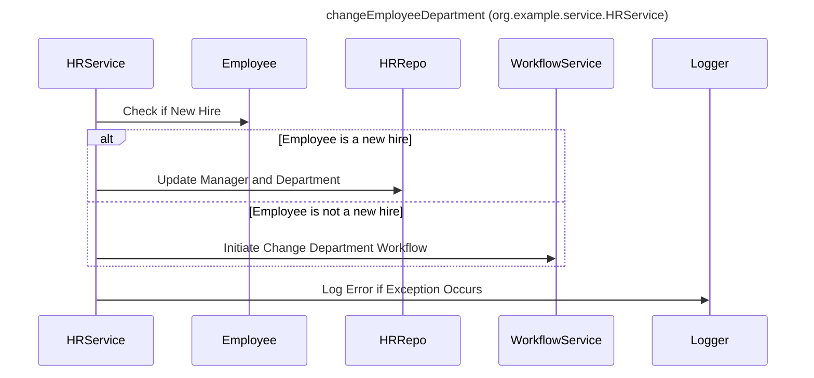

----
# ORIGINAL RESPONSE 
# Participants

* HRService
* Employee
* Department
* WorkflowService
* HRRepo
* Logger
* Level
* HRRepoException

# Initial Interactions

* HRService initiates the changeEmployeeDepartment operation.
* HRService checks if the employee is a new hire.
* If the employee is not a new hire, HRService initiates the change department workflow using the WorkflowService.
* If the employee is a new hire, HRService updates the manager and department for the employee using HRRepo.
* If there is an exception during the update operations, HRService logs the error using the Logger.

# Clean Interactions

* HRService->>Employee: Check if New Hire
* alt Employee is a new hire
    HRService->>HRRepo: Update Manager and Department
else Employee is not a new hire
    HRService->>WorkflowService: Initiate Change Department Workflow
end
HRService->>Logger: Log Error if Exception Occurs

# Final Participants

- HRService
  - HRService->>Employee: Check if New Hire
  - HRService->>HRRepo: Update Manager and Department
  - HRService->>WorkflowService: Initiate Change Department Workflow
  - HRService->>Logger: Log Error if Exception Occurs
- Employee
  - HRService->>Employee: Check if New Hire
- HRRepo
  - HRService->>HRRepo: Update Manager and Department
- WorkflowService
  - HRService->>WorkflowService: Initiate Change Department Workflow
- Logger
  - HRService->>Logger: Log Error if Exception Occurs

# Plain English Title

changeEmployeeDepartment (org.example.service.HRService)

# Mermaid Sequence Diagram

