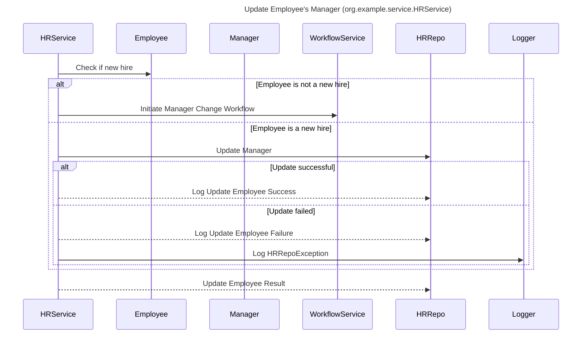

----
# FIX RAW RESPONSE 3
# Participants

* HRService (org.example.service.HRService)
* Employee
* Manager
* WorkflowService
* HRRepo
* Logger

# Validation Fixes

1. Remove newline characters from the `Validation JSON` description.
2. Validate that all participants are valid class/object names and not basic types or exceptions.
3. Ensure that all participants are in plain text and do not contain angle brackets or dots.

# Participants After Fix

* HRService
* Employee
* Manager
* WorkflowService
* HRRepo
* Logger

# Interaction After Fix

1. HRService -> Employee: Check if new hire
2. alt Employee is not a new hire
   1. HRService -> WorkflowService: Initiate Manager Change Workflow
3. else Employee is a new hire
   1. HRService -> HRRepo: Update Manager
   2. alt Update successful
      1. HRService -->> HRRepo: Log Update Employee Success
   3. else Update failed
      1. HRService -->> HRRepo: Log Update Employee Failure
      2. HRService -> Logger: Log HRRepoException
   4. end
4. HRService -->> HRRepo: Update Employee Result

# Final Participants

* HRService
* Employee
* Manager
* WorkflowService
* HRRepo
* Logger

# Plain English Title

"Update Employee's Manager (org.example.service.HRService)"

# Mermaid Sequence Diagram

